# SI Hive: Superintelligence Hive

**A local mission-control framework for AI agents.** Website: [superintelligencehive.com](https://superintelligencehive.com)

SI Hive is a web dashboard that runs on your machine and gives you visibility and control over every Claude Code (and Codex / Gemini CLI) session: live terminals, session boards, prompt queues, schedules, skills, agents, plugins, and more. It works out of the box for one person on one machine, and grows into a team tool by switching on optional modules — login, a shared database, git hosting, ticket tracking, and an LLM API — all chosen in Settings.

It is meant to be forked and extended: providers (git hosts, trackers, login systems, LLM backends) and feature modules plug in through small typed interfaces, so adding "your" service is a contained change — often one you can simply ask an AI to make.

   

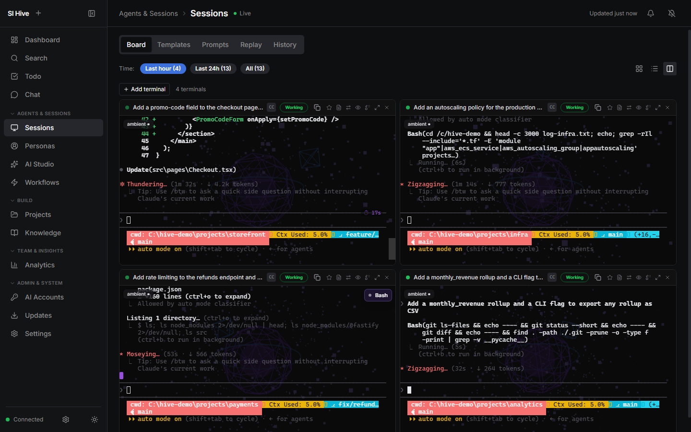

## Features

**Core (always on, local only)**
- **Terminal Grid** — multiple agent sessions side-by-side; launch, resume, or attach to any project.
- **Session Board & Tree** — every session by status (Working, Needs You, Completed), with quick approve / reject / abort / send-input.
- **Dashboard** — live overview and calendar.
- **Projects** — local projects with git status, diffs, dependency scans, and one-click launch.
- **AI Studio** — agents, skills, hooks, plugins, permissions, code scanner, docs generator.
- **Skills / Agents / Plugins managers** — including community marketplaces.
- **Chat** — a chat UI over a headless agent session.
- **Prompt library, templates, queues, loops, and schedules** (cron / interval).
- **Session replay & history**, **usage analytics**, **time tracking**.
- **Notifications** — OS alerts when an agent needs you.

**Optional modules (off until configured)**
- **Delivery** — tickets, pull requests with AI review, commit feed, CI status — backed by whichever git host / tracker you connect.
- **Knowledge & planning** — knowledge base, snippets, decisions, plans, todos, personas.
- **Workflows** — scrape / browser / API / monitor automations with Slack, Google Chat, webhook and SMTP email connectors.
- **Team** — messaging, "Now" board, session handoff, peer review, sharing, user admin (needs login + a shared database).
- **Google** — Gmail and Calendar via your own Google OAuth client.

## Screenshots

| | |
|---|---|
| **Dashboard** — what needs you right now, and every live session<br>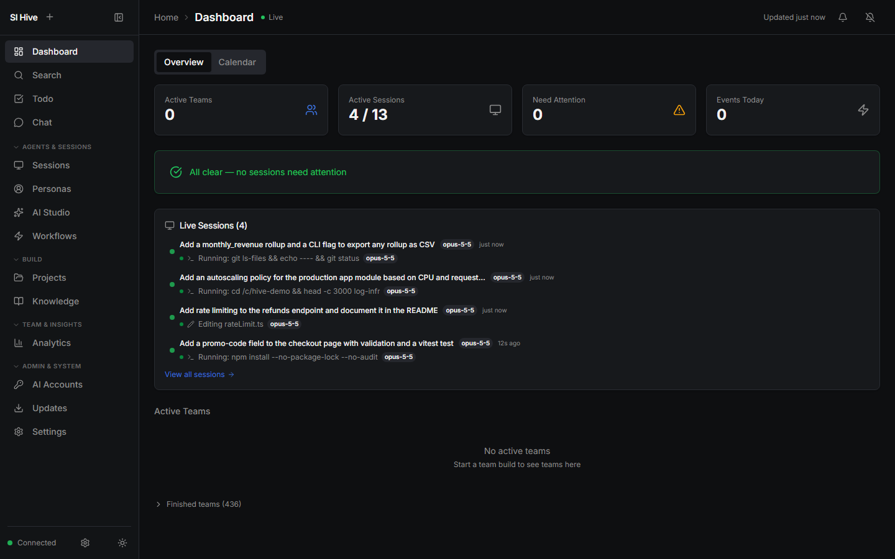 | **Session Board** — sessions by status, with the tool each agent is running<br>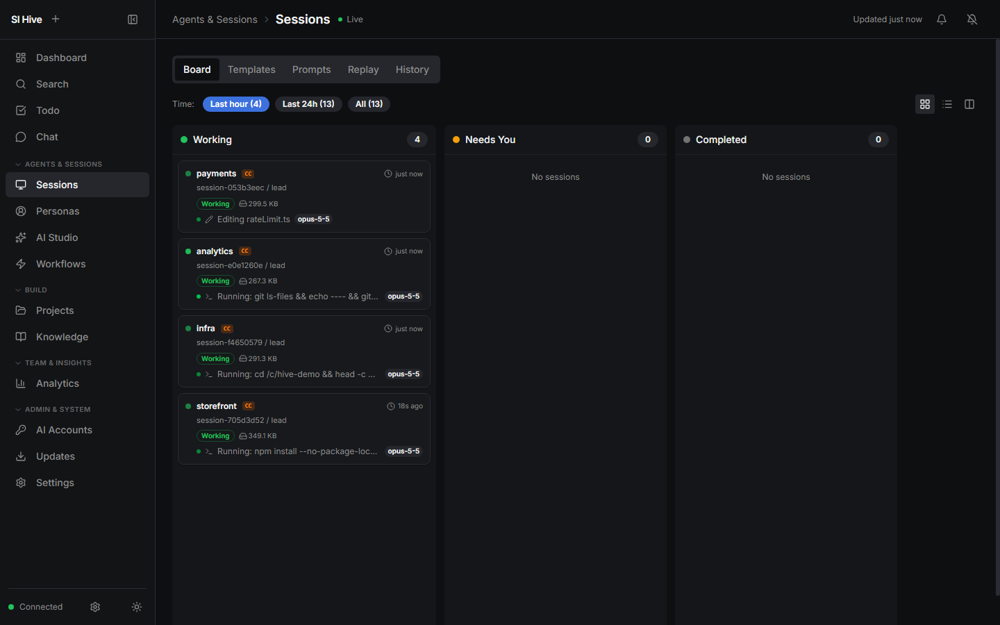 |
| **Projects** — local repos with branch, session counts and one-click launch<br>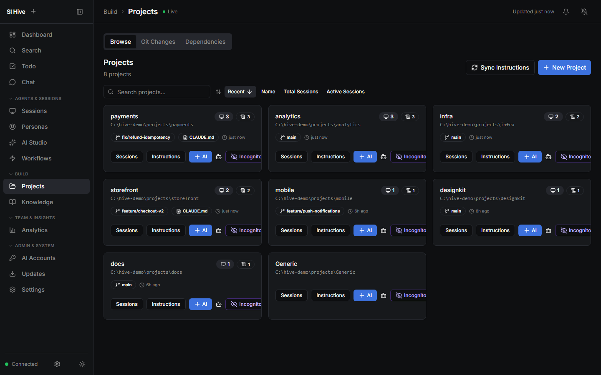 | **Prompt History** — every prompt, searchable and filterable by project<br>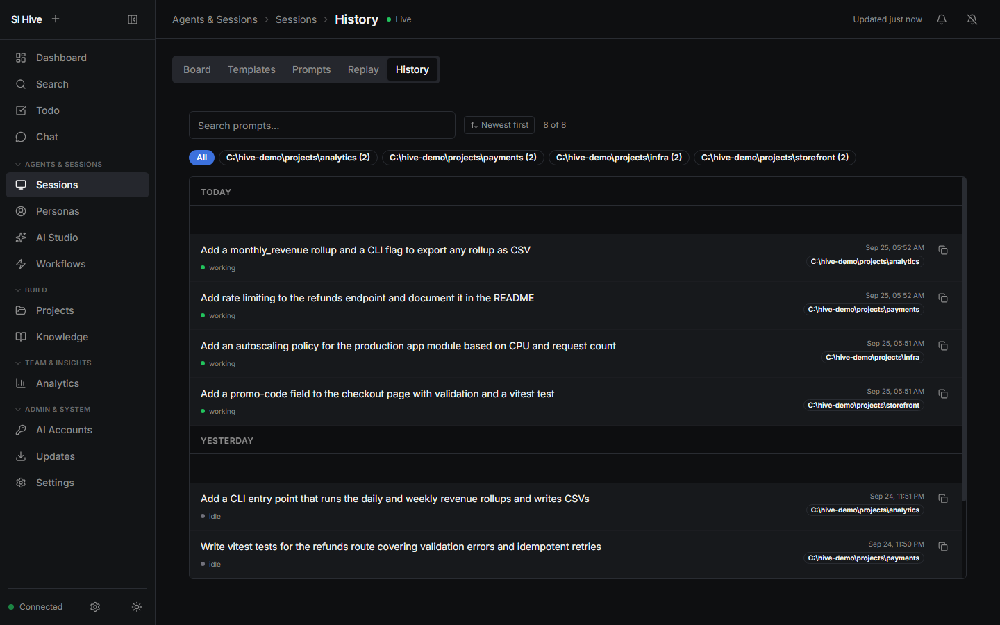 |
| **AI Studio: Agents** — manage custom subagents<br>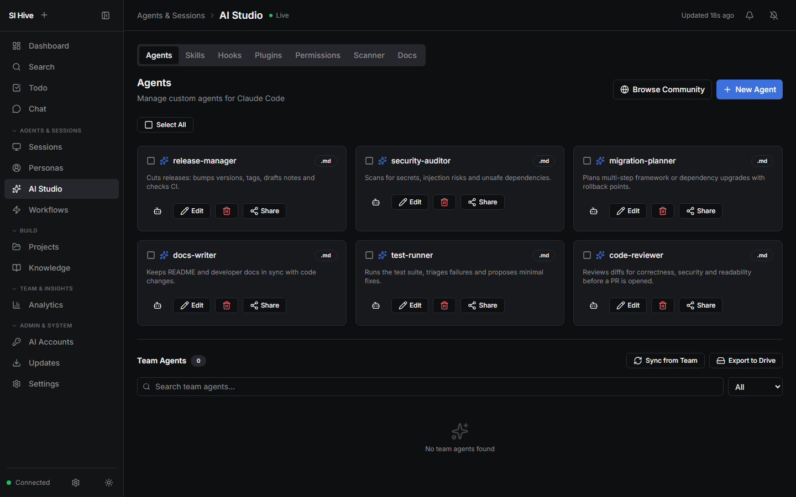 | **AI Studio: Skills** — manage skills and sync them to other AI CLIs<br>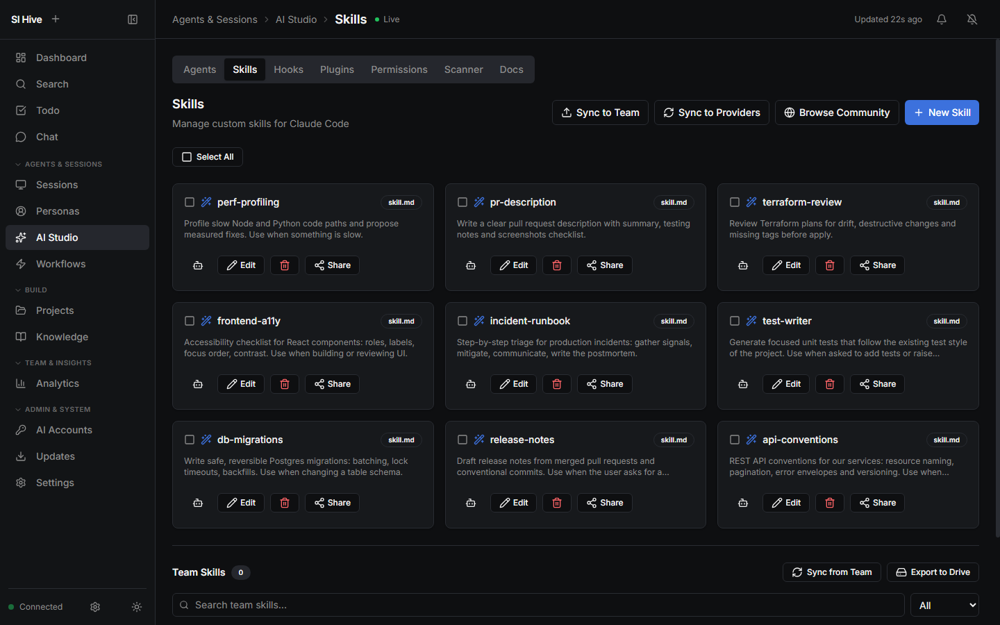 |
| **AI Studio: Plugins** — enable and disable installed plugins<br>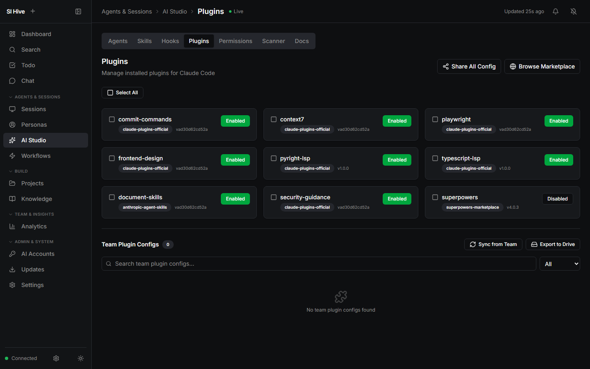 | **AI Studio: Permissions** — launch flags, presets and allow / deny / ask rules<br>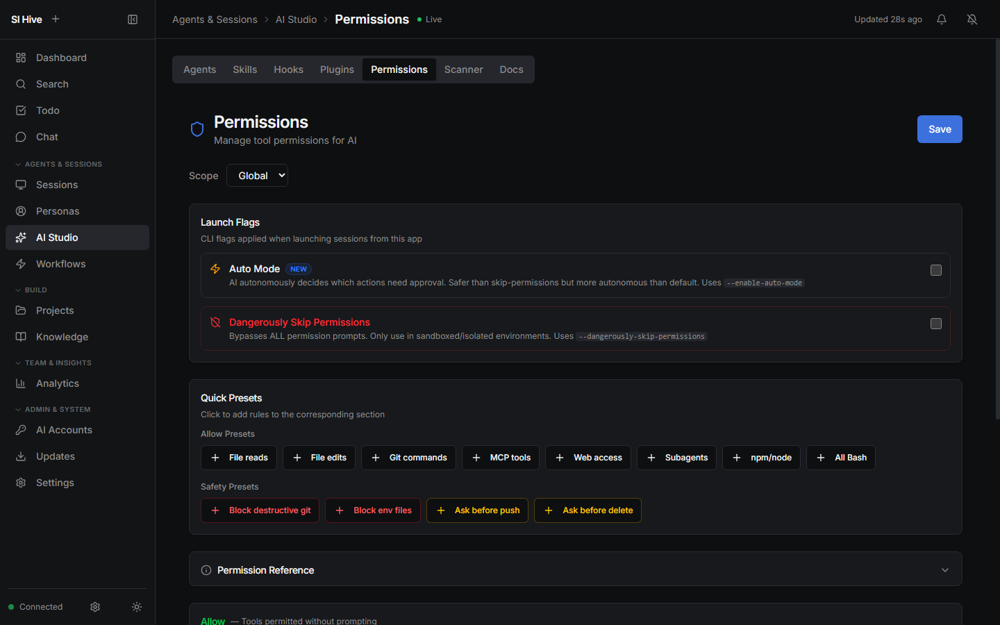 |
| **Community Marketplace** — browse and install community skills, agents and plugins<br>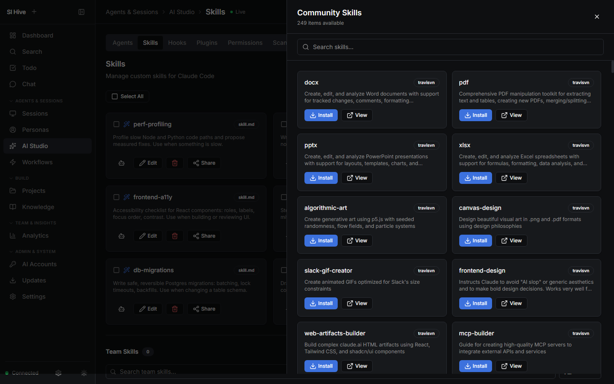 | **Workflows** — scheduled automations from templates or plain English<br>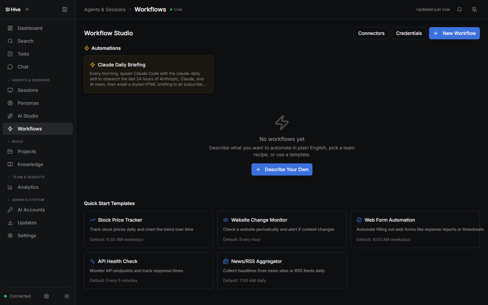 |

## Quick start

```bash
git clone <your-fork-url> hive
cd hive
npm install
npm run build:hive
HIVE_PORT=4747 npx tsx apps/hive/server/index.ts
```

Open <http://localhost:4747>. SI Hive discovers Claude Code sessions from `~/.claude/` automatically — no configuration needed. With login off (the default) the server only listens on loopback.

For an installed background service, build the Windows installer (`installer\build-installer.cmd`) or the macOS bundle (`installer/mac/`).

### Windows: run at login (recommended) or as a service

The Windows installer asks how SI Hive should run:

- **At login, as you (recommended).** SI Hive runs in your desktop session. AI sessions run as you, so git trusts your repositories, terminals use ConPTY, and browsers and the GPU are available. It runs while you are logged in.
- **As a Windows service.** SI Hive starts at boot, before anyone logs in, as the SYSTEM account in Windows' hidden service session.

To switch an existing service install to login mode, run this from an administrator PowerShell, signed in as the user SI Hive should run as. It carries over the service's `HIVE_*` settings, stops the service, sets it to manual, and starts SI Hive:

```powershell
& "C:\Program Files (x86)\SI Hive\node\node.exe" "C:\Program Files (x86)\SI Hive\app\scripts\install-autostart-windows.cjs" --replace-service
```

To switch back: `...\scripts\uninstall-autostart-windows.cjs --stop --restore-service`. For a source checkout, run the same scripts with your own `node`.

## Configuration

Everything lives in the SI Hive data directory — `~/.hive/` by default, or `$HIVE_HOME` if set (use this to run a second, isolated instance):

| File | Contents |
|------|----------|
| `config.json` | Settings (non-secret): projects, integrations, modules, UI preferences |
| `credentials.json` | Encrypted secrets (tokens, passwords, API keys) — AES-256-GCM |
| `secret.key` | Key for `credentials.json` (or set `HIVE_SECRET_KEY`) |
| `hive.db` | Local SQLite database |

Useful environment variables: `HIVE_PORT`, `HIVE_HOME`, `HIVE_HOST` (bind address), `HIVE_ALLOWED_HOSTS`, `HIVE_PUBLIC_URL` (external URL for sign-in callbacks), `HIVE_SECRET_KEY`, `HIVE_AUTH_DISABLED=1` (recovery), `HIVE_SKIP_BUNDLED_SKILLS=1`.

## Extending SI Hive

| Extension point | Where | Guide |
|-----------------|-------|-------|
| Git host / ticket tracker | `apps/hive/server/integrations/` | `docs/extending/adding-a-provider.md` |
| Feature module | `apps/hive/server/modules/registry.ts` + your module folder | `docs/extending/modules.md` |
| AI CLI provider | `apps/hive/server/providers/` | — |

`npm run lint` runs `scripts/check-generic.mjs`, which flags personal home-folder paths and real email addresses. To keep your organization's names, hosts and IDs out too, list them (one regex per line) in `scripts/check-generic.local.txt` — it is gitignored, so the list itself is never published.

## Team installs

To share one SI Hive between several people:

1. **Settings → Authentication**: add a sign-in method (Google, Microsoft Entra ID, GitHub, any OpenID Connect provider, or local accounts), use **Test sign-in** once, then turn login on. The first person to sign in becomes admin. Login on = SI Hive listens on all interfaces; put it behind TLS (reverse proxy) and set `HIVE_PUBLIC_URL`.
2. **Settings → Storage** *(optional)*: point the shared database at Postgres or SQL Server if several SI Hive instances should share data. All instances sharing one database must use the same `HIVE_SECRET_KEY`, so secrets they store there can be decrypted.
3. Locked out? Start SI Hive with `HIVE_AUTH_DISABLED=1`.

## Architecture

- **Server**: Node.js + TypeScript (HTTP + WebSocket), `apps/hive/server/`
- **Frontend**: React 19 + Vite + Zustand + Tailwind v4 + Radix UI, `apps/hive/src/`
- **Shared**: UI kit, server utilities, storage, credentials — `packages/shared/`
- **Storage**: SQLite (better-sqlite3); optional shared Postgres / SQL Server for team features

## Platform support

macOS and Windows (native). Linux works for development.

## License

MIT
